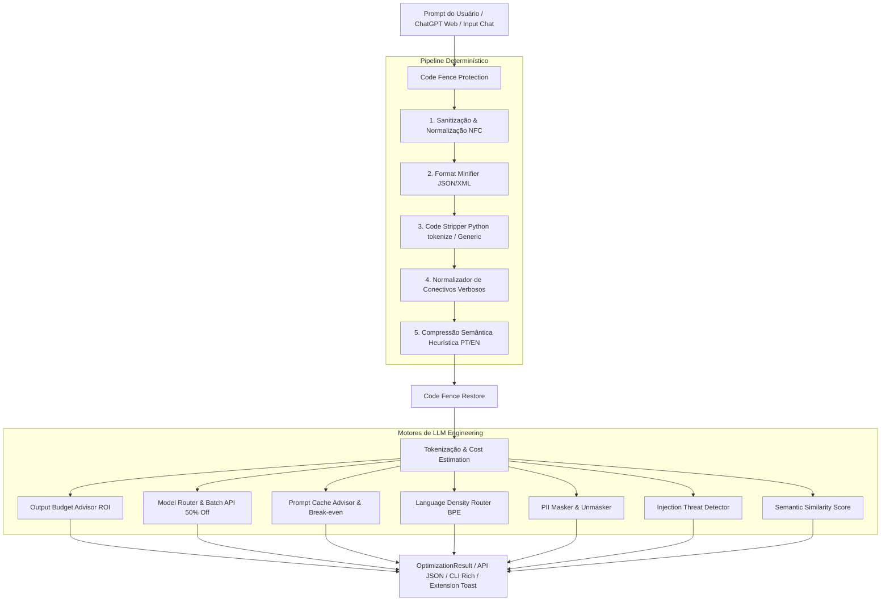

# PromptShrink 🗜️

> **Pré-processador de Prompts de IA & Engine de LLM Engineering**
> Reduza até 60% dos tokens de entrada, limite tokens de saída de alto custo e economize dinheiro em produção.

[](https://www.python.org/downloads/)
[](https://fastapi.tiangolo.com/)
[](LICENSE)

*Leia esta documentação em [English](README_EN.md).*

---

## 🧩 Última Funcionalidade: Extensão de Navegador Web (`/extension`)

O **PromptShrink** agora conta com uma extensão de navegador (Manifest V3) que adiciona o botão **`🗜️ Shrink`** diretamente na caixa de entrada do **ChatGPT**, **Claude.ai**, **Google AI Studio** e **Poe.com**.


### 🌟 Destaques da Extensão:
- **Otimização em 1 Clique:** Minifica o prompt na própria interface da web sem precisar trocar de aba.
- **Notificação de Economia em Tempo Real (Toast):** Exibe feedback instantâneo de tokens economizados (ex: `-144 tokens (-42.1%)`).
- **Motor Híbrido Resiliente:** Conecta-se à API local (`http://localhost:8000/v1/optimize`) ou utiliza um motor local de fallback rápido em JavaScript caso a API esteja offline.
- **Menu de Contexto:** Clique com botão direito do mouse sobre qualquer texto selecionado para otimizá-lo.

### 📥 Como Instalar a Extensão:
1. Acesse `chrome://extensions/` no seu navegador (Chrome, Edge, Brave).
2. Ative o **Modo do desenvolvedor** no canto superior direito.
3. Clique em **Carregar sem compactação** (*Load unpacked*) e selecione a pasta `extension/` deste repositório.

---

## 🎯 Visão Geral

PromptShrink é uma solução completa em **CLI + API Backend (FastAPI) + Extensão Web** projetada para desenvolvedores e engenheiros de LLM que consumam APIs da OpenAI, Anthropic ou Google Gemini. 

Diferente de minificadores ingênuos que quebram código ou corrompem o contexto, o PromptShrink opera com **proteção de código determinística (Code Fence Protection)**, **minificação sintática segura**, **compressão semântica heurística** e um **motor de Engenharia de LLM** para otimizar roteamento de modelo, cache de prefixo, retenção de PII e segurança contra Prompt Injection.

---

## 📐 Arquitetura do Pipeline



---

## 🚀 Funcionalidades & Vetores de Otimização

| Vetor | O que faz | Economia / Impacto |
|-------|-----------|--------------------|
| **🧩 Extensão de Navegador** | Adiciona botão `🗜️ Shrink` no ChatGPT, Claude, Gemini e Poe | **Produtividade & Economia no Browser** |
| **1 — Sanitização Determinística** | Remove espaços invisíveis, aspas tipográficas, markdown vazio, linhas duplicadas | **~5–15%** |
| **2 — Code Stripper (`tokenize`)** | Remove docstrings, comentários (`#`, `//`, `/* */`) e linhas em branco em blocos de código sem quebrar f-strings | **~30–60% no código** |
| **3 — Format Minifier** | Minifica payloads JSON e XML embutidos em prosa ou blocos | **~20–40% no payload** |
| **4 — Compressão Semântica** | Heurísticas linguísticas que eliminam cortesias e frases de enchimento (PT-BR + EN) | **~15–35%** |
| **💡 Output Budget Advisor** | Sugere restrições na instrução para limitar tokens de resposta (que custam 3-5x mais) | **ROI de 10x a 50x** |
| **🎯 Model Router Advisor** | Avalia a complexidade do prompt e sugere downgrades seguros (ex: GPT-4o → GPT-4o-mini) e opção de Batch API | **Até 94% de redução no custo** |
| **🔄 Prompt Cache Advisor** | Reordena o prompt isolando contexto fixo para ativar Prefix Caching com cálculo de Break-even por provedor | **Até 90% em cache reads** |
| **🌐 Language Density Router** | Avalia a densidade BPE do português vs inglês e sugere instrução em inglês com resposta em PT | **~20–40% na instrução** |
| **💬 Chat History Compressor** | Otimiza arrays de histórico de mensagens mantendo as últimas N mensagens intactas | **~30–50% em conversas longas** |
| **🛡️ PII Masker & Unmasker** | Mascara CPF, E-mail, Telefone, CNPJ e Cartão com placeholders neutros | **Segurança & Privacidade** |
| **⚠️ Prompt Injection Detector** | Identifica tentativas de subversão de prompt e jailbreak com score de risco | **Proteção contra ataques** |

---

## 📊 Análise de Desconto & Break-even por Provedor

Diferentes provedores de LLM aplicam políticas distintas para **Prompt Caching**:

```
Anthropic Claude ──► Read: 90% OFF (0.10x)  │ Write: 1.25x (Overhead) ──► Break-even: 2 requisições
OpenAI GPT ───────► Read: 50% OFF (0.50x)  │ Write: 1.00x            ──► Break-even: 2 requisições
Google Gemini ────► Read: 75% OFF (0.25x)  │ Write: 1.00x            ──► Break-even: 2 requisições
```

---

## 🧠 Decisões Técnicas de Engenharia

### 1. `tokenize` Nativo em vez de Regex para Código Python
- **Problema:** Regex simples para remover comentários (`#`) corrompem f-strings (`f"URL: {x}#anchor"`), comentários embutidos em multiline strings ou docstrings de funções.
- **Solução:** `code_stripper.py` utiliza o módulo nativo `tokenize` do Python para navegar a árvore de tokens lexicais, removendo apenas comentários reais (`tokenize.COMMENT`) e docstrings isoladas, preservando a sintaxe intacta.

### 2. Proteção Unificada de Código (Code Fence Protection)
- **Problema:** Regras de sanitização, normalização e compressão de texto podiam alterar termos reservadas em código (ex: `function simply()` virando `function()`).
- **Solução:** `code_fence.py` extrai todos os blocos ` ```lang ... ``` ` antes de aplicar qualquer transformação no texto, substitui por placeholders neutros (`@@PROMPTSHRINK_CODE_BLOCK_N@@`) e restaura os blocos após a otimização.

### 3. Score de Fidelidade Semântica Ponderado por N-Gramas
- **Problema:** Comparação ingênua por `set` de palavras retorna scores falsamente altos (> 95%) mesmo quando 70% das frases são deletadas.
- **Solução:** `semantic_score.py` calcula uma matriz de interseção de bag-of-words + **bigramas** (`word_pair`) ponderada pela frequência real das palavras, fornecendo uma métrica realista de retenção do significado.

---

## 🛠️ Instalação e Execução

### Requisitos
- Python 3.11 ou superior
- `pip` ou `uv`

### Instalação em Modo Desenvolvimento
```bash
git clone https://github.com/usuario/promptshrink.git
cd projeto

# Com pip
pip install -e ".[dev]"

# Com uv (recomendado)
uv sync
```

---

## 💻 Uso — Linha de Comando (CLI)

```bash
# 1. Otimizar prompt via stdin
echo "Olá! Eu gostaria que você pudesse, por favor, me ajudar..." | promptshrink optimize --model gpt-4o

# 2. Otimizar a partir de um arquivo e salvar o resultado
promptshrink optimize --from-file prompt.txt --save-to-file otimizado.txt --model claude-3-5-sonnet

# 3. Pré-análise rápida de potencial de compressão (Dry Run)
promptshrink optimize --from-file prompt.txt --dry-run

# 4. Tradução automática de instrução para Inglês
promptshrink optimize --from-file prompt.txt --apply-language --model gpt-4o

# 5. Output em JSON bruto (para scripts e automação)
promptshrink optimize --from-file prompt.txt --json

# 6. Listar modelos suportados e tabela de preços
promptshrink models
```

---

## 📡 Uso — API Backend (FastAPI)

### Iniciar o Servidor
```bash
uvicorn api.main:app --reload --port 8000
# ou via Makefile
make api
```

Documentação Swagger interativa disponível em `http://localhost:8000/docs`.

---

## 📄 Licença

Distribuído sob a licença **MIT**. Veja `LICENSE` para mais informações.
