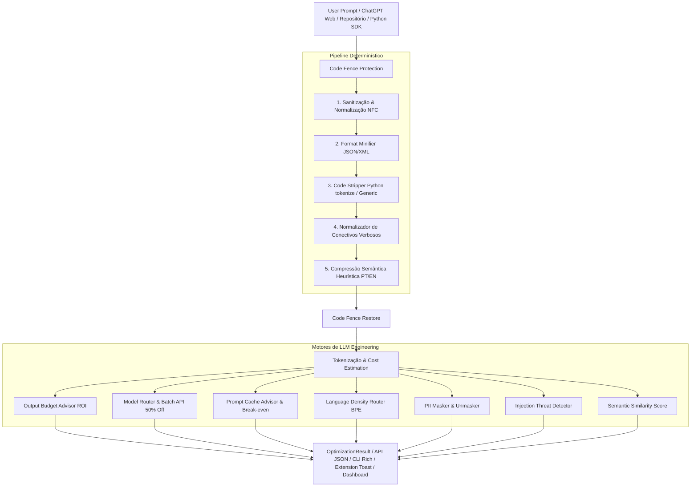

# PromptShrink 🗜️

> **Pré-processador de Prompts de IA & Engine de LLM Engineering**
> Reduza até 60% dos tokens de entrada, limite tokens de saída de alto custo e economize dinheiro em produção.

[](https://www.python.org/downloads/)
[](https://fastapi.tiangolo.com/)
[](LICENSE)

*Leia esta documentação em [English](README_EN.md).*

---

## 🧩 Novas Funcionalidades

### 1. 📂 Codebase Context Shrinker (`promptshrink repo`)
Varre projetos de código inteiros, minifica e remove comentários de cada arquivo, empacotando o repositório em um único contexto Markdown pronto para colar em LLMs (Claude, GPT-4o, Gemini):
```bash
promptshrink repo --path ./src --save-to-file context.txt
```

### 2. 🧮 Calculadora & Simulador de ROI (`promptshrink calc`)
Simula a economia mensal de custos em dólares comparando o modelo atual vs. PromptShrink + Model Router:
```bash
promptshrink calc --calls 100000 --tokens 800 --model gpt-4o
```

### 3. 📊 Embedded Web Dashboard (`GET /dashboard`)
Painel web em tempo real servido diretamente pela API FastAPI em `http://localhost:8000/dashboard`:
- Métricas de tokens salvos.
- Economia estimada em dólares ($).
- Taxa de redução percentual e regras mais ativas.

### 4. 🐍 Transparent Python SDK (`PromptShrinkClient`)
Wrapper Python simples para otimização direta em aplicações:
```python
from promptshrink.sdk import PromptShrinkClient

client = PromptShrinkClient(default_model="gpt-4o")
optimized_text = client.optimize_text("Olá! Por favor me ajude com...")
```

### 5. 🧩 Extensão de Navegador Web (`/extension`)
Extensão Manifest V3 que adiciona o botão **`🗜️ Shrink`** no **ChatGPT**, **Claude.ai**, **Google AI Studio** e **Poe.com**:
- Instalação: `chrome://extensions/` ➔ *Carregar sem compactação* ➔ pasta `extension/`.

---

## 🎯 Visão Geral

PromptShrink é uma solução completa em **CLI + API Backend (FastAPI) + SDK Python + Extensão Web** projetada para desenvolvedores e engenheiros de LLM que consumam APIs da OpenAI, Anthropic ou Google Gemini.

Diferente de minificadores ingênuos que quebram código ou corrompem o contexto, o PromptShrink opera com **proteção de código determinística (Code Fence Protection)**, **minificação sintática segura**, **compressão semântica heurística** e um **motor de Engenharia de LLM** para otimizar roteamento de modelo, cache de prefixo, retenção de PII e segurança contra Prompt Injection.

---

## 📐 Arquitetura do Pipeline



---

## 🚀 Funcionalidades & Vetores de Otimização

| Vetor | O que faz | Economia / Impacto |
|-------|-----------|--------------------|
| **📂 Codebase Shrinker** | Varre e minifica repositórios inteiros em 1 payload | **~50-60% no contexto do repositório** |
| **🧮 ROI Calculator** | Simula custos e economia financeira mensal em escala | **Visibilidade de custos** |
| **📊 Web Dashboard** | Painel em tempo real em `http://localhost:8000/dashboard` | **Telemetria de Economia** |
| **🐍 Python SDK Wrapper** | Wrapper Python para otimização direta no código | **Integração limpa** |
| **🧩 Extensão de Navegador** | Adiciona botão `🗜️ Shrink` no ChatGPT, Claude, Gemini e Poe | **Produtividade no Browser** |
| **1 — Sanitização Determinística** | Remove espaços invisíveis, aspas tipográficas, markdown vazio | **~5–15%** |
| **2 — Code Stripper (`tokenize`)** | Remove docstrings, comentários (`#`, `//`, `/* */`) sem quebrar f-strings | **~30–60% no código** |
| **3 — Format Minifier** | Minifica payloads JSON e XML embutidos em prosa | **~20–40% no payload** |
| **4 — Compressão Semântica** | Heurísticas que eliminam cortesias e frases verbosas (PT-BR + EN) | **~15–35%** |
| **💡 Output Budget Advisor** | Restringe tokens de resposta (que custam 3-5x mais) | **ROI de 10x a 50x** |
| **🎯 Model Router Advisor** | Recomenda downgrades seguros (ex: GPT-4o → GPT-4o-mini) e Batch API | **Até 94% de redução no custo** |
| **🔄 Prompt Cache Advisor** | Reordena o prompt para Prefix Caching com cálculo de Break-even | **Até 90% em cache reads** |

---

## 🛠️ Instalação e Execução

```bash
git clone https://github.com/usuario/promptshrink.git
cd projeto
pip install -e ".[dev]"
```

---

## 💻 Uso — Linha de Comando (CLI)

```bash
# 1. Otimizar prompt via stdin
echo "Olá! Eu gostaria que você pudesse, por favor, me ajudar..." | promptshrink optimize --model gpt-4o

# 2. Minificar um repositório inteiro
promptshrink repo --path ./src --save-to-file context.txt

# 3. Simular economia mensal
promptshrink calc --calls 100000 --tokens 800 --model gpt-4o

# 4. Listar modelos e preços
promptshrink models
```

---

## 📡 Uso — API Backend (FastAPI)

```bash
uvicorn api.main:app --reload --port 8000
```
- OpenAPI Swagger: `http://localhost:8000/docs`
- Web Dashboard: `http://localhost:8000/dashboard`

---

## 📄 Licença

Distribuído sob a licença **MIT**. Veja `LICENSE` para mais informações.
